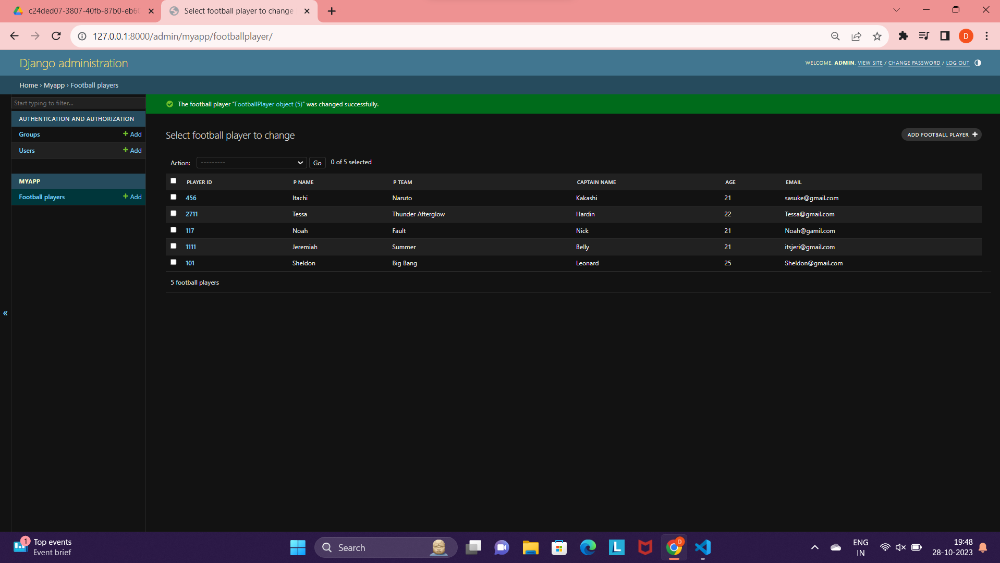

# Ex02 Django ORM Web Application
## Date: 28-10-2023

## AIM
To develop a Django application to store and retrieve data from a Football Players database using Object Relational Mapping(ORM).

## DESIGN STEPS

### STEP 1:
Clone the problem from GitHub

### STEP 2:
Create a new app in Django project

### STEP 3:
Enter the code for admin.py and models.py

### STEP 4:
Execute Django admin and create 10 Football players

## PROGRAM
```
models.py
from django.db import models
from django.contrib import admin

class FootballPlayer(models.Model):
    player_id = models.CharField(max_length=20, help_text="Player ID")
    p_name = models.CharField(max_length=100)
    p_team=models.CharField(max_length=100)
    captain_name=models.CharField(max_length=100)
    age = models.IntegerField()
    email = models.EmailField()

class FootballPlayerAdmin(admin.ModelAdmin):
    list_display = ('player_id', 'p_name','p_team' ,'captain_name', 'age', 'email')


admin.py
from django.contrib import admin
from .models import FootballPlayer,FootballPlayerAdmin
admin.site.register(FootballPlayer,FootballPlayerAdmin)

```
## OUTPUT


## RESULT
Thus the program for creating a database using ORM hass been executed successfully
